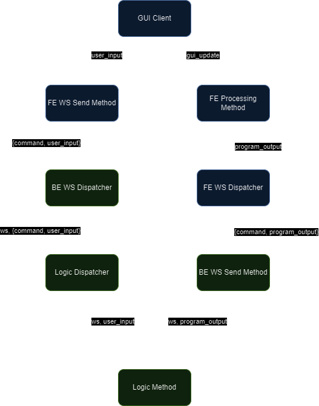

# Generic LAN Python GUI

**Author:** Chris Milne (Lux-Ferre)

## Table of Contents
1. [Overview](#overview)
2. [Context](#context)
3. [Goals](#goals)
4. [Existing Solution](#existing-solution)
5. [Proposed Solution](#proposed-solution)
6. [User Interface](#user-interface)
7. [Technologies](#technologies)
8. [Deployment](#deployment)
9. [Future Work](#future-work)
10. [Glossary](#glossary)
11. [Appendix](#appendix)

## Overview

This project aims to develop a versatile and robust web-based GUI for executing Python scripts. The primary objective is to create a generic, terminal-like interface that can be utilized across various small Python scripts, making it easy for users to interact with them through a consistent and intuitive front-end. By leveraging a combination of Flask for the backend and Bootstrap with jQuery for the frontend, the system will facilitate real-time communication between the client and server using WebSockets.

The GUI will be designed to handle user inputs and script outputs dynamically, displaying them in a manner that mimics a traditional terminal. This approach will not only simplify the user interaction process but also enhance the demonstration capabilities of these scripts over a local area network (LAN). The architecture employs the command dispatch design pattern on both the front-end and back-end, ensuring efficient and scalable handling of commands and responses.

With a focus on usability and flexibility, this project will cater to the needs of developers who require a standardized interface for their Python scripts, particularly in environments where quick and effective demonstrations are necessary. The goal is to provide a tool that enhances both development efficiency and user experience.

## Context

The primary use case for this application is for small scripts that do not need a custom GUI. This includes the majority of solutions to APUG challenges. Additionally, the GUI should be usable across the LAN for demonstration purposes, making it easier to showcase and interact with these scripts in a networked environment.

## Goals

The primary goal of this project is to produce a generic GUI application that can be used as the front-end for any small script where that script is built into a template class. Specific goals include:
- **Versatility**: Ensure the GUI can handle a variety of scripts with minimal modification.
- **Usability**: Design an intuitive and user-friendly interface.
- **Network Capability**: Enable the GUI to function over a LAN for demonstration purposes.

## Existing Solution

Currently, only pure CLIs are used if there is any user interaction at all. There is no network-visible solution, which limits the usability and demonstration capabilities of these scripts.

## Proposed Solution

A web UI using Bootstrap and jQuery, served from a Flask backend. A websocket connection will be used to bridge the front-end (FE) and back-end (BE). 

### Detailed Description
- **Frontend (FE)**: A responsive web interface built with Bootstrap and enhanced with jQuery for dynamic content handling.
- **Backend (BE)**: A Flask server to manage HTTP requests and websocket connections.
- **WebSocket Connection**: Facilitates real-time communication between FE and BE.
- **Script Integration**: On load, a path will be provided to a `.py` file containing a `Logic` class to be imported. The `Logic` class must contain a config property being a dict of configurations. It must also contain a `dispatch()` method to handle incoming messages from the UI.

### Command Dispatch Design Pattern
Both the front end and back end will utilize the command dispatch design pattern for handling the data passed via the websocket. This design pattern provides a structured and scalable way to handle different commands and their associated logic.

#### Front End
- **Command Handling**: The front end will use JavaScript to capture user inputs from the input field and send commands through the websocket connection.
- **Command Dispatch**: A dispatcher function will map the incoming commands to their corresponding handlers, ensuring that each command is processed appropriately before being sent to the back end.

#### Back End
- **Command Handling**: The back end will receive commands through the websocket connection and use a similar dispatch function to route the commands to their corresponding methods in the `Logic` class.
- **Command Dispatch**: The `dispatch()` method in the `Logic` class will map the incoming commands to their respective handlers, ensuring that the appropriate logic is executed for each command.

### Architecture Diagram

#### Diagram Breakdown

1. **GUI Client**:
   - User inputs (`user_input`) are captured in the GUI client.
   - Outputs from the backend (`gui_update`) are displayed in the GUI client.

2. **Frontend WebSocket (FE WS) Send Method**:
   - Sends `{command, user_input}` to the backend.

3. **Backend WebSocket (BE WS) Dispatcher**:
   - Receives `{command, user_input}` from the frontend.
   - Dispatches the command to the `Logic Dispatcher`.

4. **Logic Dispatcher**:
   - Routes the command and user input to the appropriate `Logic Method`.

5. **Logic Method**:
   - Processes the command and generates `program_output`.
   - Sends `program_output` back to the frontend via the backend WebSocket.

6. **Backend WebSocket (BE WS) Send Method**:
   - Sends `{command, program_output}` to the frontend.

7. **Frontend WebSocket (FE WS) Dispatcher**:
   - Receives `{command, program_output}` from the backend.
   - Processes the output in the FE Processing Method.

8. **FE Processing Method**:
   - Updates the GUI client with the `program_output`.

## User Interface

The proposed UI will mimic a terminal, providing a familiar environment for users who are accustomed to command-line interfaces.

### UI Components
1. **Output Field**: 
   - A large, scrollable text area where the output from the script will be displayed.
   - This field will display text in a monospaced font to mimic the appearance of a terminal.
   - It will update dynamically to show real-time results from the script execution.

2. **Input Field**:
   - A smaller text input field where users can type commands.
   - This field will also use a monospaced font to maintain the terminal-like appearance.

3. **Send Button**:
   - A button labeled "Send" located next to the input field.
   - Clicking this button will send the command from the input field to the backend via the websocket connection.
   - The command will be processed by the `Logic` class, and the output will be displayed in the output field.

### UI Layout
- The output field will occupy the majority of the interface, positioned at the top.
- The input field and send button will be positioned below the output field, aligned horizontally.
- The overall design will be simple and clean, focusing on functionality and ease of use.

## Technologies

- **Frontend**: Bootstrap, jQuery (delivered via official CDNs)
- **Backend**: Flask
- **Communication**: WebSocket
- **Python**: For the script logic and integration

## Deployment

### Prerequisites
- **Python**: Install Python 3.x.
- 
### Installation Steps
1. **Clone Repository**: Clone the project repository from the version control system.

* *Note: Using a virtual environment is not necessary but is highly recommended to avoid dependency conflicts and to manage project-specific packages more effectively.* 

2. **Create Virtual Environment**: Run `python -m venv venv` to create a virtual environment.
3. **Activate Virtual Environment**: 
   - On Windows, run `venv\Scripts\activate`.
   - On MacOS/Linux, run `source venv/bin/activate`.
4. **Install Dependencies**: Run `pip install -r requirements.txt` to install Python dependencies.
5. **Run Application**: Use `flask run` to start the backend server. Open the frontend in a browser to access the GUI.

### Configuration
- **Config File**: Provide a configuration file to customize paths and settings for different environments.

## Future Work

- **Documentation**: Comprehensive documentation for developers and end-users.
- **Config Overrides**: Allow logic class configurations to replace default values.
- **Custom GUI Support**: Enable the ability to replace the default terminal-like GUI with a custom one, controlled by the logic configurations.
- **Logic File Selection Page**: Provide a dedicated page in the GUI for users to select which logic file to open.

## Glossary

- **APUG**: Aberdeen Python User Group
- **GUI**: Graphical User Interface
- **CLI**: Command Line Interface
- **LAN**: Local Area Network
- **FE**: Front-End
- **BE**: Back-End

## Appendix

### References

- [Flask](https://flask.palletsprojects.com/)
- [Bootstrap](https://getbootstrap.com/)
- [jQuery](https://jquery.com/)

### Related Documents

- [APUG Repository](https://github.com/PythonAberdeen/user_group)
